# Lab10 Deploy

[TOC]

# Due Date

Week 13 Tuesday 9:00 am [Sydney Local Time](https://www.timeanddate.com/worldclock/australia/sydney).

# Note

1. We'll be using a very basic express server to demonstrate deployment! It has a basic implementation of the following routes:
    - root (`/`),
    - echo (`/echo/echo`),
    - add name (`/add/name`),
    - view names (`/view/names`), and
    - clear (`/clear`)

2. Although it is not a requirement that you deploy to Vercel in this lab, we recommend doing so as you will receive the most support from our staff this way.

3. There are several steps, please patiently go through each of them. **Please read the lab instructions regarding the [submission process](#testing-and-submitting-your-deployed_url) carefully** when you've finished.

4. Click [here](https://youtu.be/YBMWfwXAfSo) for a demo of this lab!

# Background

## Rationale

Deploy deploy deploy 🚀! While having our forum application working locally is fun and all, there's no point if you can't show it off to everyone else 😎!

In this lab, you will expose your backend server application to the outside world via serverless functions and using databases. You can use it to chat with your friends, host secret parties or plot a coup d'etat against DPST1093 staff - the possibilities are endless!

## Context

<details>

<summary> A quick visual guide on how deployment will change things for us.</summary>

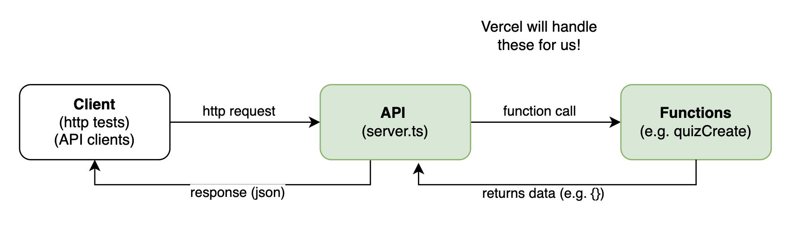

</details>

Normally, we have to run our API (`server.ts`) and its associated functions on one terminal, while having another terminal open to run our tests. Vercel however, can handle the former for us! All we need to do after that is to configure our HTTP requests to go to our deployed URL, instead of our localhost URL.

## Getting Started

- Copy the SSH clone link from Gitlab and clone this repository on either VLAB or your local machine.
- In your terminal, change your directory (using the cd command) into the newly cloned lab.

## Package Installation

1. Open [package.json](package.json) and look at existing packages in "dependencies" and "devDependencies". Install them with:
    ```shell
    $ npm install
    ```

1. That's it :). You'll notice we have a very basic express server. Feel free to skim through the codebase and run `npm start` on one terminal and `npm t` on another to ensure everything is passing as expected.

# Task

An image guide is available for some of the instructions below. You can toggle their visibility by clicking on the respective text - for example:

<details close>
<summary>Click this line of text to toggle image visibility</summary>

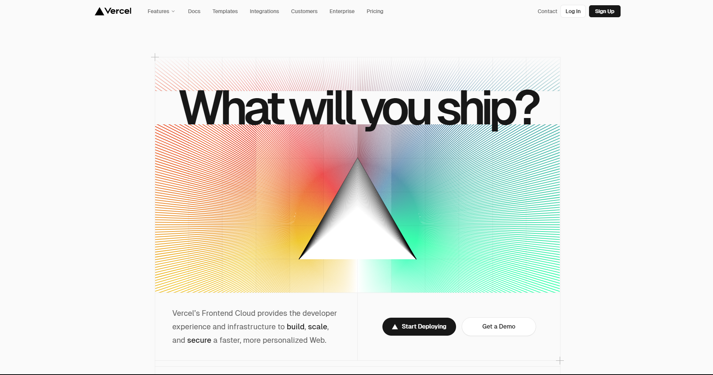

</details>

Make sure to also read the tips given by Vercel as you progress through the lab. **Don't just blindly follow the instructions given**, as there will be inputs that you will need to modify accordingly for your needs.

## 0. Create Accounts
1. **A private github account:** Vercel requires you to link your backend repository to deploy it. If you do not currently have an account, you should create one by following the link: https://github.com/signup

2. **A Vercel account:** Vercel offers us a serverless method to deploy our backend repository. The setup is completely free and does not require any payment methods for sign-up. Create an account and select **Continue with GitHub** so that your accounts can be linked: https://vercel.com/signup.

Why do all of this?
<details close>
<summary>Visual explanation of what we're trying to do</summary>
We're attempting to link our code to Vercel. To do this, we will be using a Github account as an intermediary.

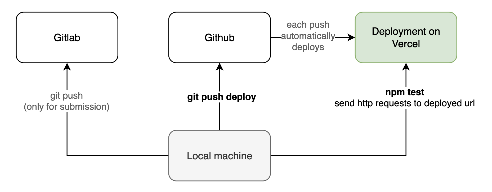

</details>


## 1. Duplicate your repository to GitHub

1. In a separate window, log in to your GitHub account and select **New repository**.
    <details close>
    <summary>Top Left > Dropdown > New Repository</summary>

    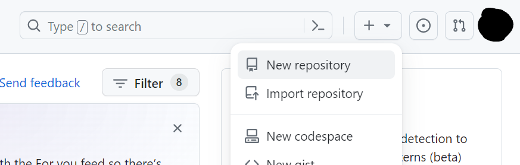

    </details>

2. Name your repository, e.g. "`Lab10-Deploy`", and make sure to select **Private**. Then hit **Create Repository**.
    <details close>
    <summary>Create Repository Form - example details</summary>

    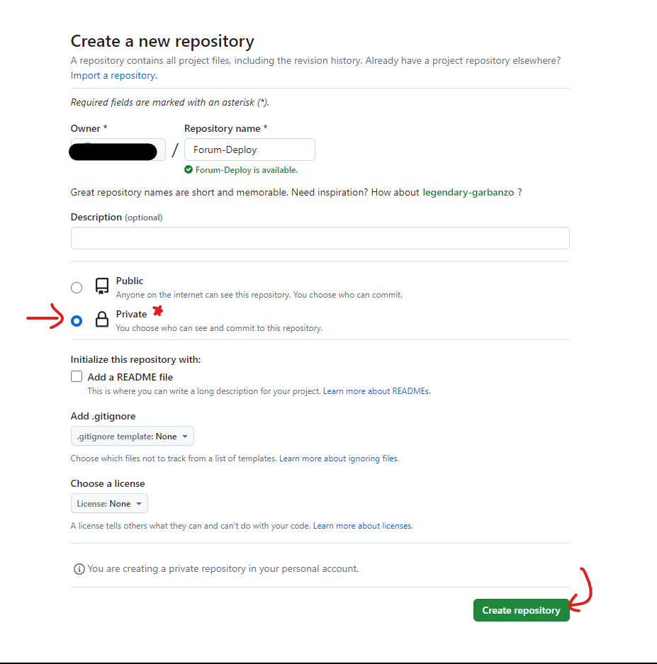

    </details>
3. Just in case you missed it, please ensure the Github repo is **private**.
4. You should be automatically navigated to your created repository. Back on your terminal, use the following code to update your GitHub repository.
```shell
# Replace <SSH_URL> with your Github repository's SSH URL.
# The SSH URL can be found in the empty Github repo you just created.
# E.g. git@github.com:USERNAME/Lab10-Deploy.git
$ git remote add deploy <SSH_URL>
$ git push deploy
```
After running the command, your GitHub repository should then be populated with the code from your backend.

**NOTE**: **Whenever you want to update your Github repository (hence Vercel as well)**, run `git push deploy` after changes have been added and committed. If you only run `git push` this will send your changes to Gitlab, not Github.

Getting a "`git@github.com: Permission denied (publickey)` or similar access rights error? You'll need to add your SSH-Key to Github! Just like we did for Gitlab in [`lab01_git`](https://cgi.cse.unsw.edu.au/~dp1093/redirect/?path=DPST1093/24T3/students/_/lab01_git#adding-your-ed25519-ssh-key-to-gitlab). See instructions below, and then attempt to push again.
- Generate a new SSH Key (optional): https://docs.github.com/en/authentication/connecting-to-github-with-ssh/generating-a-new-ssh-key-and-adding-it-to-the-ssh-agent
- Add SSH key to Github: https://docs.github.com/en/authentication/connecting-to-github-with-ssh/adding-a-new-ssh-key-to-your-github-account


## 2. Deploy Server using Vercel
*[Vercel](https://en.wikipedia.org/wiki/Vercel) is a cloud platform as a service company. Vercel architecture is built around [composability](https://en.wikipedia.org/wiki/Composability).*

1. In your repo, install the [vercel](https://www.npmjs.com/package/vercel) package
    ```shell
    $ npm install vercel
    ```

2. **In the root directory**, create a file called `vercel.json` and copy the following content into the file. This essentially configures our Vercel deployment to redirect all routes to the `server.ts` file.
    ```json
    {
      "version": 2,
      "builds": [
          {
              "src": "src/server.ts",
              "use": "@vercel/node"
          }
      ],
      "routes": [
          {
            "src": "/(.*)",
            "dest": "src/server.ts"
          }
      ]
    }
    ```

3. Add and commit all changes and push them up to the repository:
    ```shell
    $ git push deploy
    ```
    If you forget to add, commit and push deploy, you may get `404 not_found` errors later on.
4. On the Vercel homepage, log into Vercel and then select the `Add New...` button and `Project` selection.
    <details close>
    <summary>Top Left > Add New > Dropdown > Project </summary>

    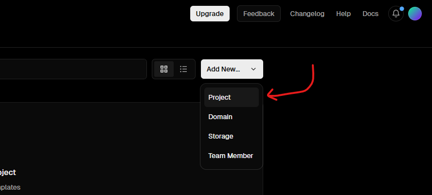

    </details>

5. Select `Import` on the repository that you created in GitHub.
    <details close>
    <summary>Select Github Provider </summary>

    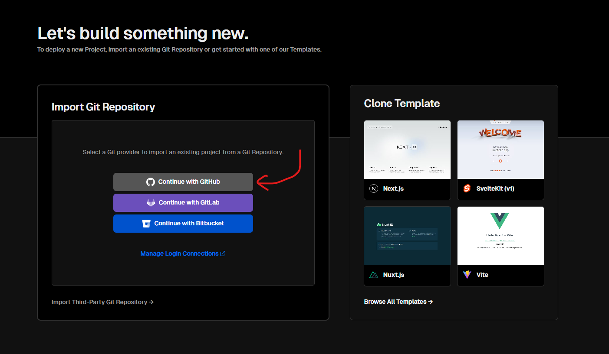

    </details>
    <details close>
    <summary>Import Git Repository > Import </summary>

    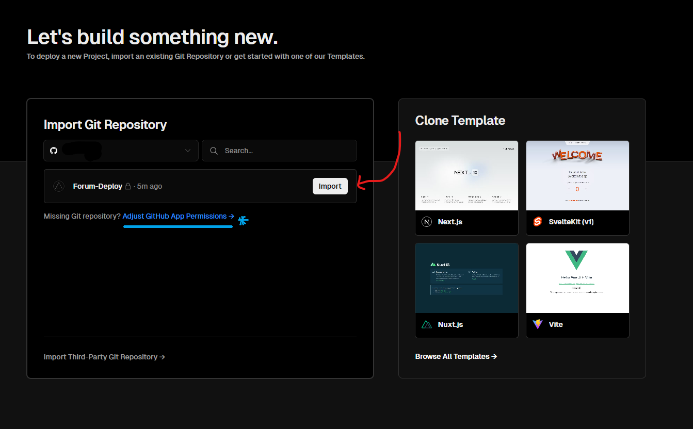

    </details>

    Can't see your github repo? Follow the `Adjust GitHub App Permissions →` link and instructions.

6. Select `Deploy` to deploy your repository and wait shortly for your repository to be built.
    <details close>
    <summary> Configure Project > Deploy </summary>

    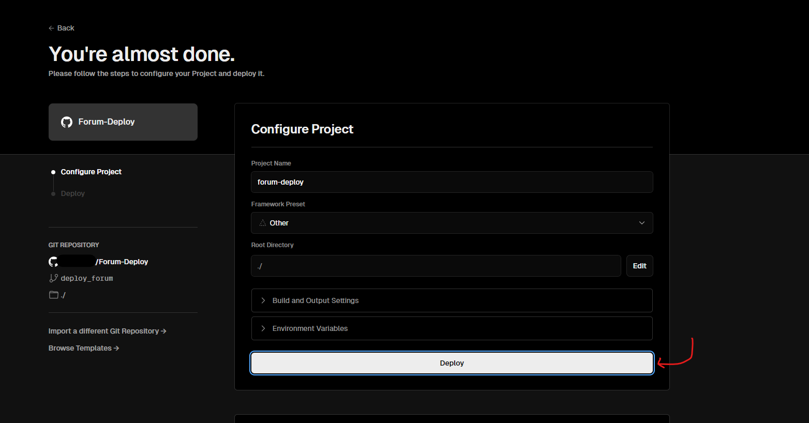

    </details>

    If successful, you should see a "Congratulations" and on your `Dashboard` see your deployment with a green "Ready" Status.
    <details close>
    <summary> Successful Deployment View </summary>

    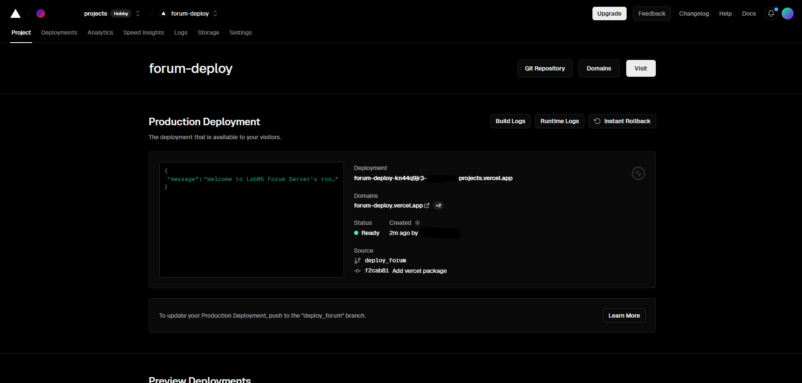

    </details>

    **If there's an error, you can [click on this video](https://youtu.be/fMovx1dWy2I)** which can guide you through the process of how to fix it.
    Otherwise, you can follow these instructions. First, click on `Inspect Deployment` at the bottom of the page.  You should end up on the `Deployment Details` page.
    If the build log mentions `npm ERR! code 1` go back to your project and click on the `Settings` tab. Then scroll down and change the Node version to 18. Afterwards, go back to the `Deployments` tab and click on the ellipsis button of your latest deployment. Then click `Redeploy`.

7. Make your deployed url contain your zID. Go to `Project Settings` > `Domains` > `Edit`, and modify your domain name to include your zID, e.g. `z1234444-forum-deploy.vercel.app`.
    <details close>
    <summary> Homepage > Project Menu > Settings </summary>

    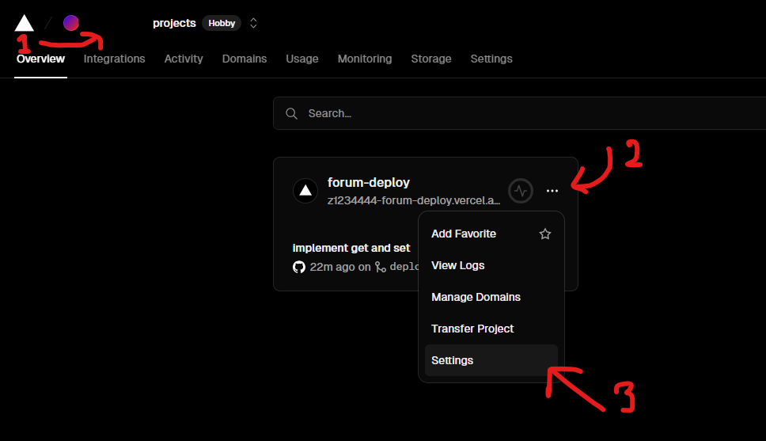

    </details>
    <details close>
    <summary> Project Settings > Domain > Edit </summary>

    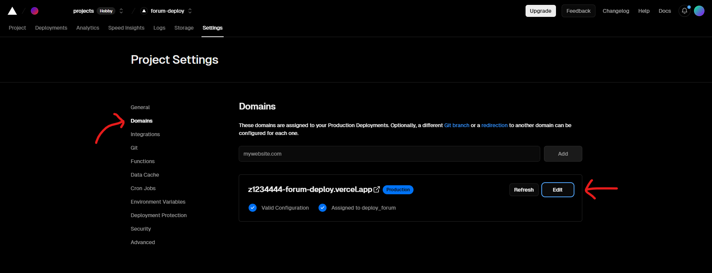

    </details>

8. Congratulations! You've now deployed your server onto the web...somewhat. If you (or a friend) visits the root (`/`) or echo (`/echo/echo?message=hello`) routes on your deployed url, your deployed server should respond with the resulting response from your backend - awesome!

    However, as soon as you try to access other routes that manipulate your data store, you'll start running into server errors.

    <details close>
    <summary> Failed DELETE '/clear' request using API Client  </summary>

    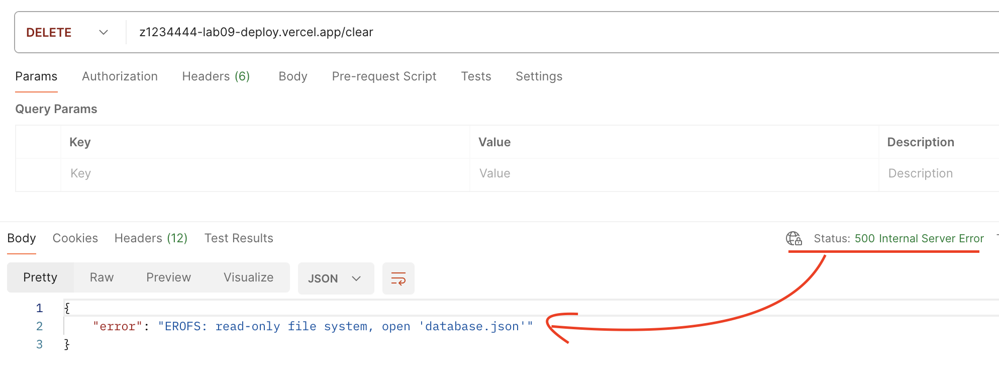

    </details>

    Why is this the case? Well, Vercel is a [serverless](https://vercel.com/docs/functions/serverless-functions) deployment option that will only respond when a request is made. Any state variables, including local files e.g. `database.json`, will not be preserved. This means that if we'd implemented persistence - we'd lose it! What's a more robust solution? Instead of reading and writing to a file in our folder, let's read and write our data from an online database.

## 3. Setup Deployed Database
For the project we've been persisting data by writing to a json file, e.g. `database.json`. This however will not work anymore as we can't write to files on Vercel! What we will do instead is **store everything as a key-value pair** in Vercel's online database. So in the case of lab10 it might look like:
```typescript
{ "names": ["Giuliana", "Yuchao"] }
```
To set this up, follow these steps:
1. On your deployment page, navigate to the `Storage` tab.
    <details close>
    <summary>Top Bar > Storage </summary>

    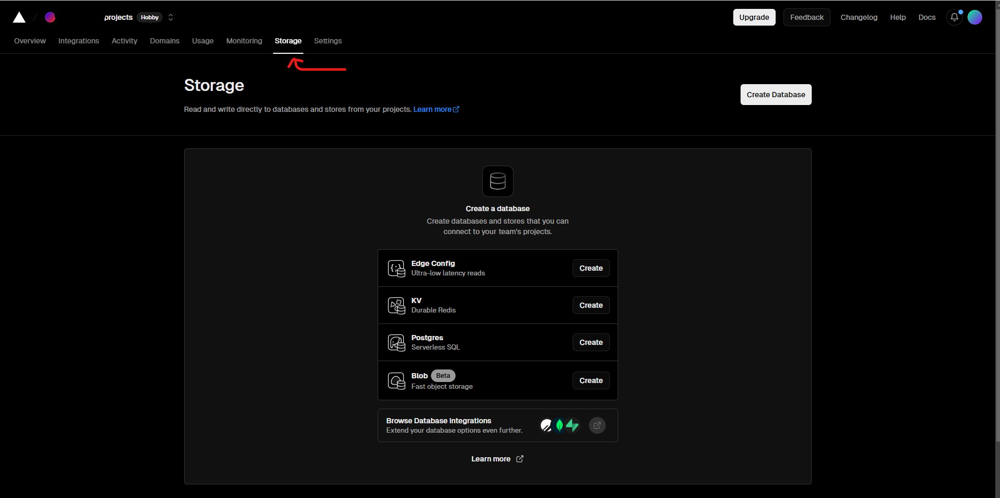

    </details>

2. Select `Create New Database` and select the `KV` option. You can use any database name, e.g. `Forum Database`, but make sure the `Primary Region` is `Washington, D.C., USA iad1`. **DO NOT SELECT PRIMARY REGION AS SYDNEY** as this will lead to longer round trip times for network requests between your deployment and your database.
    <details close>
    <summary>Create KV Database Form - example details </summary>

    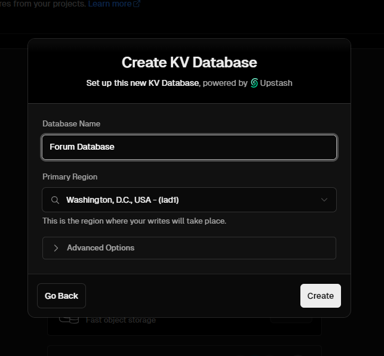

    </details>

3. Afterwards select `Create` and navigate to the database.
4. Navigate to the "`.env.local`" tab. Select show secret and copy the `KV_REST_API_URL` and `KV_REST_API_TOKEN`.
    <details close>
    <summary> All Databases >  KV Database > .env.local </summary>

    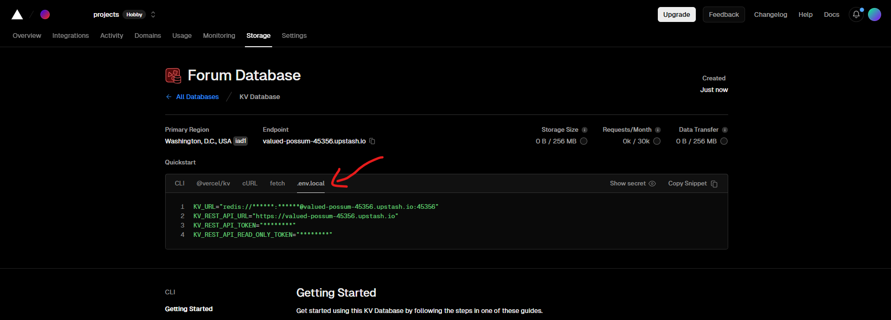

    </details>

5. Back on your terminal, install [@upstash/redis](https://upstash.com/docs/redis/sdks/ts/getstarted)
    ```shell
    $ npm install @upstash/redis
    ```
6. Copy and declare the `KV_REST_API_URL` and `KV_REST_API_TOKEN` as const variables inside the `server.ts` file. You can see them by clicking on the `Show Secret` button. Copy the following code snippet into [src/server.ts](src/server.ts) to open a client so that we can request to read or write to our database.
    ```typescript
    import { Redis } from '@upstash/redis';

    // Replace this with your KV_REST_API_URL
    // E.g. https://happy-duck-41120.upstash.io
    const KV_REST_API_URL="https://YOUR-URL";
    // Replace this with your KV_REST_API_TOKEN
    // E.g. AaywASQgOWE4MTVkN2UtODZh...
    const KV_REST_API_TOKEN="YOUR-API_TOKEN";

    const database = new Redis({
      url: KV_REST_API_URL,
      token: KV_REST_API_TOKEN,
    });
    ```
    Make sure to copy the right token, otherwise, you may get an error later on such as `NOPERM this user has no permissions to run the 'hset' command`.

## 4. Use Deployed Database
1. Create two new routes inside [src/server.ts](src/server.ts) to get and update your deployed database respectfully. These routes will serve as way to grab and update our online repository. An example code snippet can be found below:
    ```typescript
    app.get('/data', async (req: Request, res: Response) => {
      const data = await database.hgetall("data:names");
      res.status(200).json(data);
    });

    app.put('/data', async (req: Request, res: Response) => {
      const { data } = req.body;
      await database.hset("data:names", { data });
      return res.status(200).json({});
    });
    ```
    And with that, we can now set and grab our data from an online database using Vercel KV.

    Don't forget to `git add`, `git commit`, and then `git push deploy`, to re-deploy your application on Vercel. If you miss this step your changes made won't be applied.

    Try testing this route by sending a PUT request via an API client.
    <details close>
    <summary> API Client PUT Request </summary>

    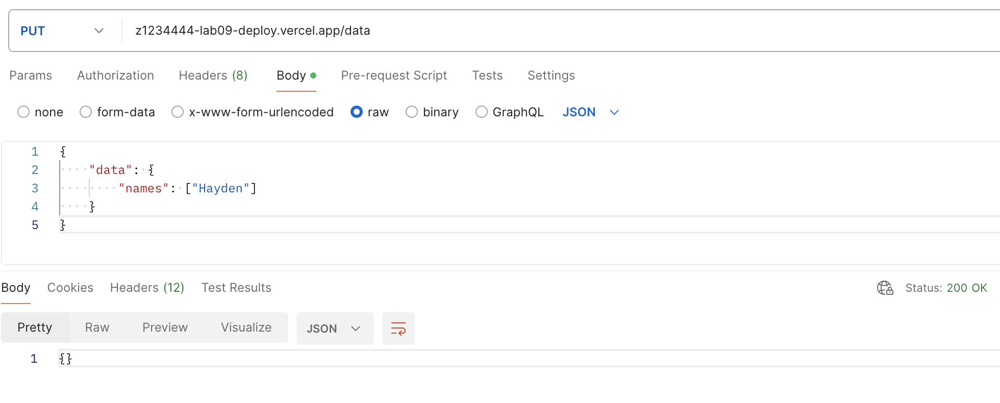

    </details>

    And likewise, if you send a GET request you should be able to retrieve the data you just set.

    From here, when you need to `setData()` or `getData()` you should send a request to the server route with the data information you want.

    In order to understand what is happening, recall that everything is being stored as a key-value pair in our online database, for example: 
    ```typescript
    { "names": ["Giuliana", "Yuchao"] }
    ```
    `database.hgetall` will return the value of the key `names`. Similar to a getData operation. While `database.hset` sets the value for that key. Similar to a setData operation. 

2. Modify the way we currently read and write data in [src/names.ts](src/names.ts) to use the routes we just created.

    An example implementation can be found below:

    ```typescript
    import request, { HttpVerb } from 'sync-request';
    // Ensure that your DEPLOYED_URL has been updated correctly
    import { DEPLOYED_URL } from './submission';
    ```

    ```typescript
    const requestHelper = (method: HttpVerb, path: string, payload: object) => {
      let json = {};
      let qs = {};
      if (['POST', 'DELETE'].includes(method)) {
        qs = payload;
      } else {
        json = payload;
      }

      const res = request(method, DEPLOYED_URL + path, { qs, json, timeout: 20000 });
      return JSON.parse(res.body.toString());
    };

    const getData = (): Data => {
      try {
        const res = requestHelper('GET', '/data', {});
        return res.data;
      } catch (e) {
        return {
          names: []
        };
      }
    };

    export const setData = (newData: Data) => {
      requestHelper('PUT', '/data', { data: newData });
    };
    ```

    This is just one example, as students may have different keys or methods to save persistent data.

3. **Note**: For the deployed server you **MUST use the `sync-request`** and **NOT `sync-request-curl`**. Currently, the default Node environment Vercel uses to build projects does not include binaries which `sync-request-curl` relies on.

    Make sure to install [sync-request](https://www.npmjs.com/package/sync-request),
    ```shell
    $ npm install sync-request
    ```

    and then utilise `sync-request` instead of `sync-request-curl` across your server and function implementation.
    ```typescript
    // Replace sync-request-curl for sync-request in your server
    // import request, { HttpVerb } from 'sync-request-curl';
    import request, { HttpVerb } from 'sync-request';
    ```

## Testing and Submitting your DEPLOYED_URL

1. Open [src/submission.ts](src/submission.ts) and modify the `DEPLOYED_URL` to your newly deployed site, e.g. https://z1234444-anything-you-want.vercel.app.

    **A reminder that the `DEPLOYED_URL` must contain your zID exactly once.** You may need to go to Settings > Domains > and edit your deployed url to include your zID.

2. Again, don't forget to `git add`, `git commit`, and then `git push deploy`, to re-deploy your application on Vercel. If you miss this step your changes made won't be applied.

4. Ensure all tests pass by running `npm t`, it should take around 20 seconds (NOTE: don't forget to remove the `test.todo` and uncomment the actual test suite!). If there are issues, head to the debugging section below.

## Common Issues

  <details close>
  <summary> 1. Vercel is not deploying the code you expect </summary>

  - Remember to `git add`, `git commit` and `git push deploy`. This will ensure that Github and hence Vercel receive your updated code. 
  - After you've pushed your code to GitHub, ensure the commit hash on GitHub matches the one on Vercel. 
  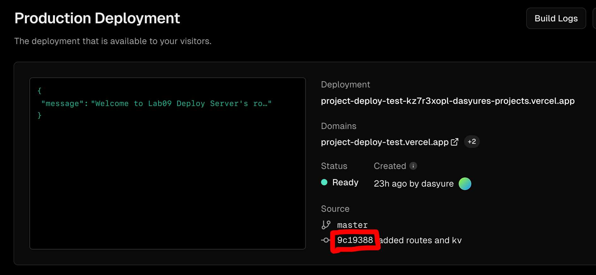
  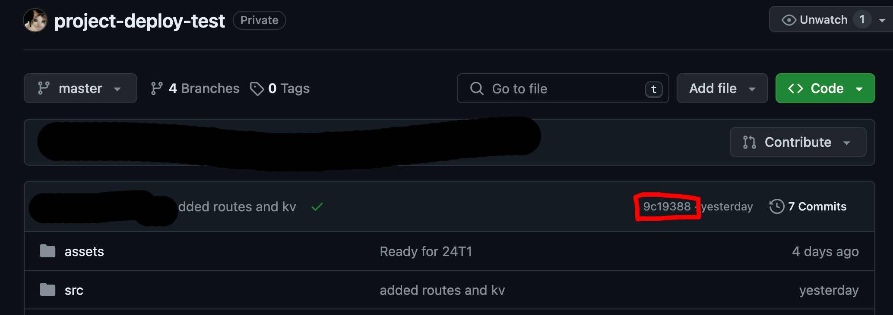
  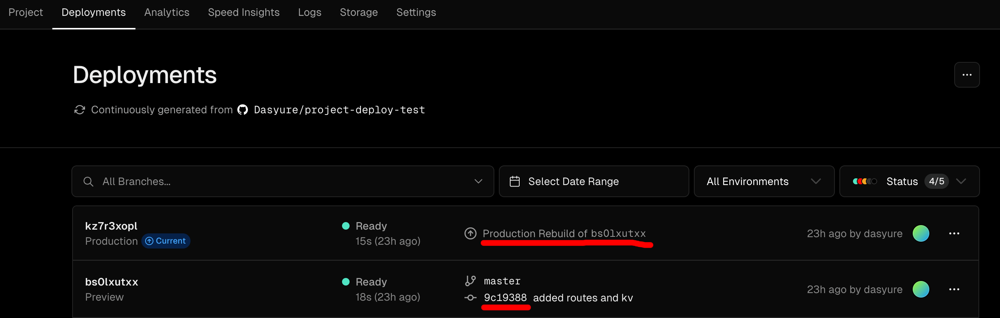

  - You can also check if Vercel has the correct files, by clicking on Your project > Source. Ensure that each file is as expected. Check for example if the `DEPLOYED_URL` was updated.
  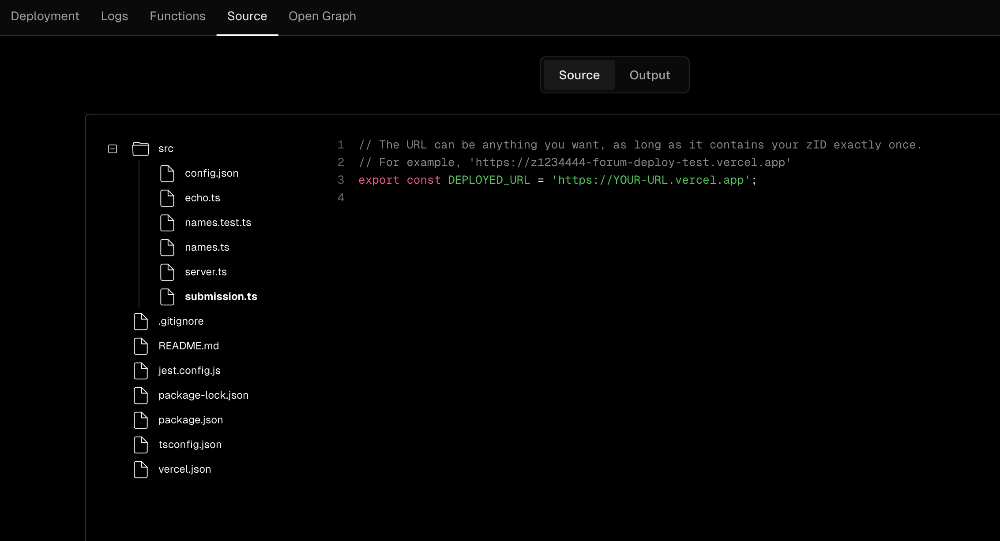
  </details>

  <details close>
  <summary> 2. Incorrect format for deployed URL </summary>

  - Ensure the URL begins with `http` or `https`. Also check that it **doesn't** end with `/`. 
  </details>

  <details close>
  <summary> 3. You've changed branches at some point </summary>

  - Go to Settings > Git. Scroll down to Production Branch and change the name of the branch. 
  - Additionally if you go to the Deployments tab, you may see that it says Preview, like in the image below. For the latest deployment, click on the ellipse icon (three horizontal dots) on the very right and click 'Promote to production'. 
  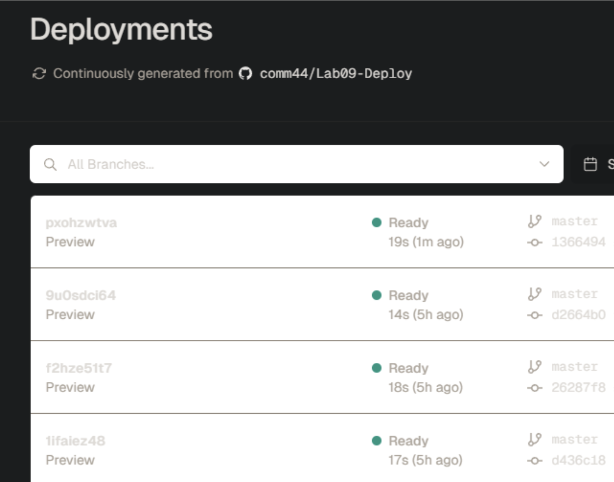
  </details>

  <details close>
  <summary> 4. You're getting a 404 error </summary>

  - You have very likely forgotten to push `vercel.json`! Follow the steps in section 1 of Common Issues. 
  </details>


## Debugging tips
  <details close>
  <summary> 1. Use an API client </summary>

  - API clients such as Postman are extremely helpful for this lab.

  - Send requests to `GET/PUT` methods for `/data` to see whether things are stored as expected.
  - Replicate tests you've made, by sending requests to the routes for `clear`, `addName` and `viewNames`.

  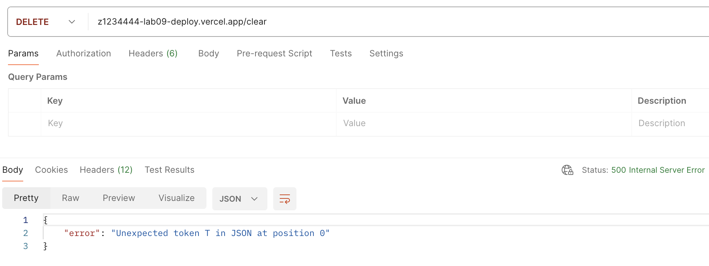

  - For those curious, the issue above was caused by forgetting to add, commit and push changes made to `submission.ts`.
  </details>

  <details close>

  <summary> 2. Check the logs </summary>

  - Your project > Deployment > Click on the latest deployment > Log
  - Instead of having `server.ts` output to a terminal, it gets output here.
  - Any `console.log` statements in your server or function implementations, will also show here.
  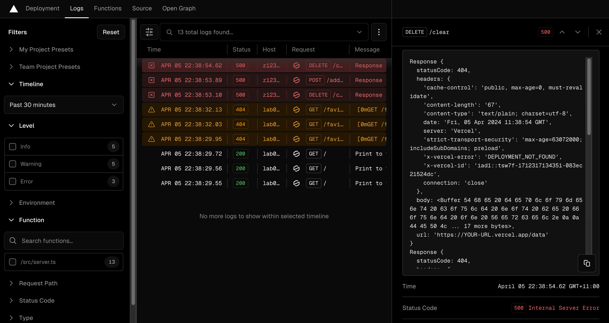
  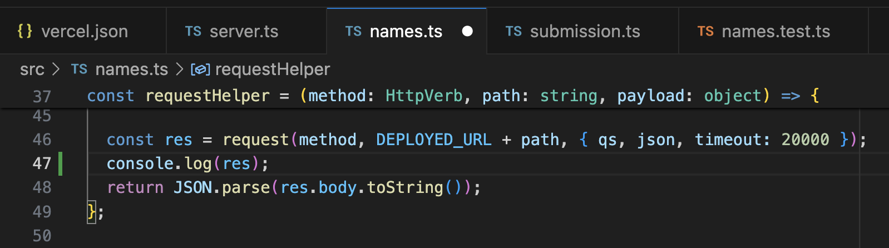

  </details>

  <details close>
  <summary> 3. General tips & Additional resources </summary>

  - Use `test.only` in your tests to focus on one test at a time if you are failing them.
  - Debugging can require running `git push deploy` frequently. Whenever that occurs, it will redeploy your project. Keep in mind that Vercel only allows 100 deployments a day.
  - If deployment is failing during setup, read the error message by going to Your project > Deployment > Click on the latest deployment > Read the deployment details.
  - [Vercel Error Codes](https://vercel.com/docs/errors)
  - [Upstash KV Debugging](https://upstash.com/docs/redis/sdks/ts/troubleshooting)
  - There is a demo for the lab [here](https://youtu.be/YBMWfwXAfSo) which can help guide you.  
  </details>

# Submission
- Use `git` to `add`, `commit`, and `push` your changes on your master branch. This time, you don't use `git push deploy` as that only updates Vercel and Github, not Gitlab. Your GitLab pipeline should also pass.
- Check that your code has been uploaded to your Gitlab repository on this website (you may need to refresh the page).
- Check that your zID inside `DEPLOYED_URL` is correct. Typos won't be accepted as grounds for a re-run. 

**If you have pushed your latest changes to master on Gitlab no further action is required! At the due date and time, we automatically collect your work from what's on your master branch on Gitlab.**

Afterwards, assuming you are working on a CSE machine (e.g. via VLAB), we strongly recommend that you remove your `node_modules` directory with the command:
```shell
$ rm -rf node_modules
```
This is because CSE machines only allow each user to have a maximum of 2GB, so you will eventually run out of storage space. It is always possible to `npm install` your packages again!
